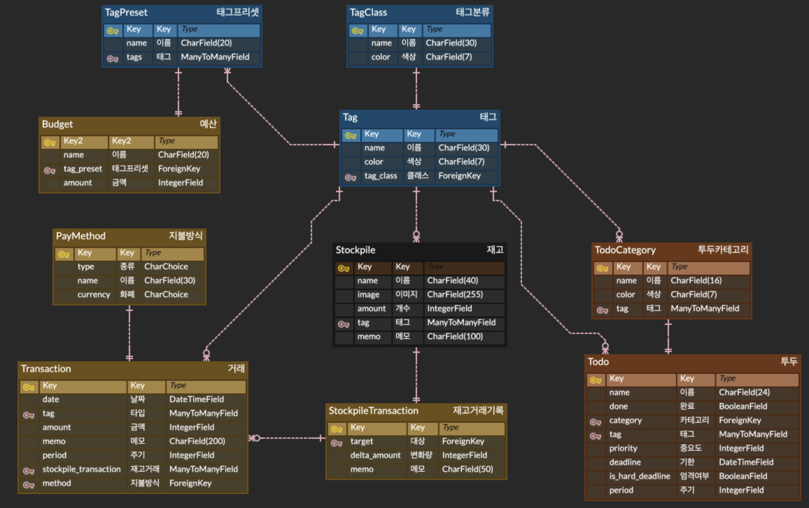

## 자취(독립) 재고 관리 및 가계부 정산

### How to make project skeleton?
- Preparation
```python
   python manage.py prepare_tags
   python manage.py createsuperuser
```
- 2023년 6월~8월경.

#### Latest Screenshot


#### Backend ERD Model Structure
- [ERD Cloud Link](https://www.erdcloud.com/d/FicREAFG6x97kzDmw)

#### MEMO
- [React Native Dev](https://reactnative.dev/)
  
##### Frontend
- [Color Name Presets](https://www.w3schools.com/colors/colors_names.asp)
- [Display:Flex 상태에서 overflow는 다음 줄에 배치되도록](https://stackoverflow.com/questions/62249771/how-can-i-make-my-flex-divs-overflow-to-the-next-line)
- [How to disable text selection(drag)](https://stackoverflow.com/questions/826782/how-to-disable-text-selection-highlighting)
- [Month Name from Date](https://stackoverflow.com/questions/1643320/get-month-name-from-date)
- [Month Day Length from Date](https://stackoverflow.com/questions/1184334/get-number-days-in-a-specified-month-using-javascript)
- [Conditional Rendering Animation!](https://stackoverflow.com/questions/61428958/react-js-how-to-animate-conditionally-rendered-components)
- [Electron Migration](https://blog.codefactory.ai/electron/create-desktop-app-with-react-and-electron/1-project-setting/)

##### Backend
- [Django: DateTimeField 필터링](https://stackoverflow.com/questions/1317714/how-can-i-filter-a-date-of-a-datetimefield-in-django)
- [Django Admin Cookbook](https://books.agiliq.com/projects/django-admin-cookbook/en/latest/introduction.html)
    - Django Model Plural Name Setting
- [Month Day Length from year, month](https://stackoverflow.com/questions/4938429/how-do-we-determine-the-number-of-days-for-a-given-month-in-python)
- [Django Object Clone: pk를 None으로 설정하고 save()](https://jnj1.tistory.com/33)